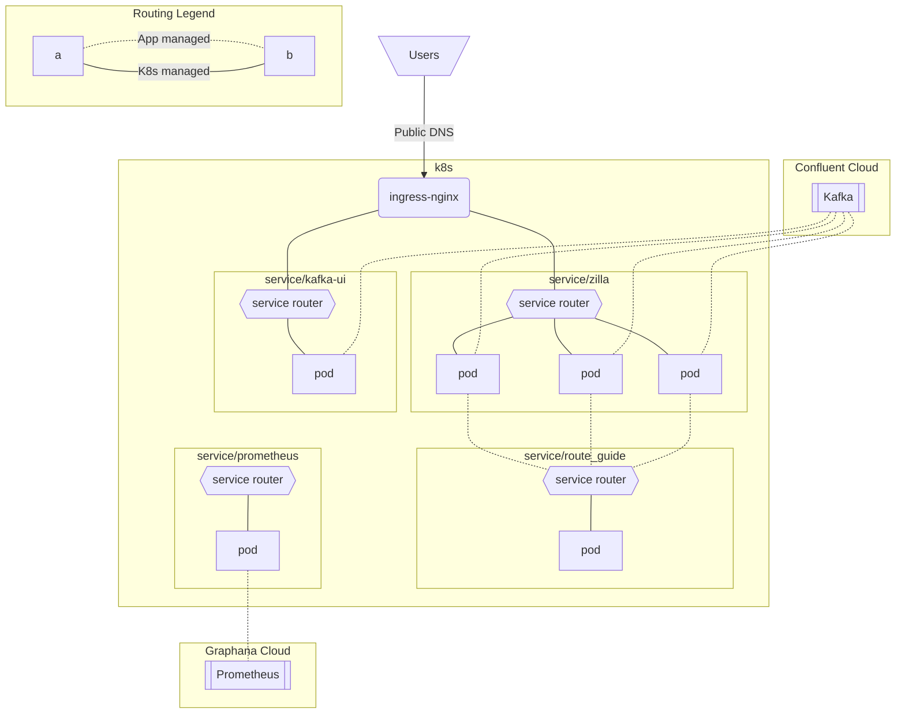

aws eks update-kubeconfig --name zilla-demos

- might need for public protection
kubectl apply -f https://raw.githubusercontent.com/nginxinc/kubernetes-ingress/v3.4.3/deploy/crds.yaml

```mermaid
flowchart TD

    subgraph Routing Legend
        direction LR
        a -..- |App managed| b
        a ---- |K8s managed| b
    end

    u[\Users/] -->|Public DNS| in(ingress-nginx)

    subgraph k8s
        in --- zsr
        in --- ksr

        subgraph service/zilla
            zsr{{service router}} --- zspa[pod]
            zsr{{service router}} --- zspb[pod]
            zsr{{service router}} --- zspc[pod]
        end
        subgraph service/kafka-ui
            ksr{{service router}} --- kspa[pod]
        end
        subgraph service/route_guide
            rgsr{{service router}} --- rgpa[pod]
            zspa -.- rgsr
            zspb -.- rgsr
            zspc -.- rgsr
        end
        subgraph service/prometheus
            psr{{service router}}---pspa[pod]
        end
    end

    subgraph Confluent Cloud
        cc[[Kafka]] -..- kspa
        cc -..- zspa
        cc -..- zspb
        cc -..- zspc
    end
    subgraph Graphana Cloud
        pspa -.- GC[[Prometheus]]
    end

```
