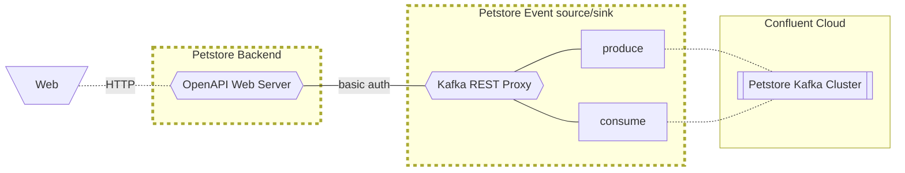
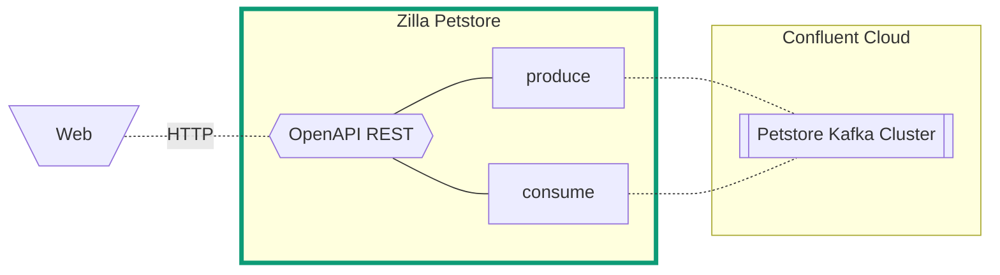

# Zilla Petstore using OpenAPI 3.x & AsyncAPI 3.x

This is an implementation of the common Petstore example where requests are proxied to Kafka. Zilla is implementing the REST endpoints defined in an OpenAPI 3.x spec and proxying them onto Kafka topics defined in an AsyncAPI 3.x spec based on the operations defined in each spec.

## Petstore Architecture Diagram

### Without Zilla



### With Zilla





## Run the demo locally

The local demo uses a [docker-compose.yaml](docker-compose.yaml) setup and can be started running the [setup.sh](setup.sh) script. Running this script again will only restart the `zilla` service.

This demo implements two different versions of the Petstore API example. You can set the `PETSTORE_VERSION` env var as `v1` or `v2` with the setup script to change between the deployed versions.

|v1 | apicurio registry url|
| -- | -- |
| [petstore-openapi-v1.yaml](petstore-openapi-v1.yaml) | [petstore-openapi/versions/v1](http://localhost:8081/apis/registry/v2/groups/petstore/artifacts/petstore-openapi/versions/v1) |
| [petstore-kafka-asyncapi-v1.yaml](petstore-kafka-asyncapi-v1.yaml) | [petstore-asyncapi/versions/v1](http://localhost:8081/apis/registry/v2/groups/petstore/artifacts/petstore-asyncapi/versions/v1) |

| v2 | apicurio registry url|
| -- | -- |
| [petstore-openapi-v2.yaml](petstore-openapi-v2.yaml) | [petstore-openapi/versions/v2](http://localhost:8081/apis/registry/v2/groups/petstore/artifacts/petstore-openapi/versions/v2) |
| [petstore-kafka-asyncapi-v2.yaml](petstore-kafka-asyncapi-v2.yaml) | [petstore-asyncapi/versions/v2](http://localhost:8081/apis/registry/v2/groups/petstore/artifacts/petstore-asyncapi/versions/v2) |

```bash
PETSTORE_VERSION=v2 ./setup.sh
```

## Generate jwt token

Use this script from the root directory of this demo to generate a JWT for authenticating your REST client.

```bash
docker run --rm -v ./private.pem:/private.pem bitnami/jwt-cli encode \
    --alg "RS256" \
    --kid "example" \
    --iss "https://auth.example.com" \
    --aud "https://api.example.com" \
    --exp=+7d \
    --no-iat \
    --payload "scope=read:all write:all write:pets read:pets" \
    --secret @private.pem \
    | pbcopy
```

## Using the Petstore APIs

The Zilla Petstore is an [HTTP Kafka proxy](https://docs.aklivity.io/zilla/latest/concepts/kafka-proxies/http-proxy.html) and exposes common entity CRUD endpoints with the entity data being stored on Kafka topics. Leveraging Kafka's `cleanup.policy=compact` feature, Zilla enables a standard REST backend architecture with Kafka as the storage layer. A UUID is generated for created objects and used as the Kafka message key.

### Generate a REST client

Use your favorite REST client with either OpenAPI spec to generate an interface into this demo. You can also fork our [Public postman collection](https://www.postman.com/aklivity-zilla/workspace/aklivity-zilla-live-demos/collection/28401168-ac7e51ac-5560-4169-9e4b-77ea02e5801d) which is generated using the `petstore-openapi-v2.yaml`.

### Synchronous APIs

Both the `/pet` and `/store/order` endpoints all proxy to Kafka synchronously meaning they will behave like a normal rest endpoint where the message persists on a kafka topics

- The [petstore-pets](http://localhost:8080/ui/clusters/localhost/all-topics/petstore-pets/messages) Kafka topic will have all the pets you posted, updated, and deleted.
- The [petstore-orders](http://localhost:8080/ui/clusters/localhost/all-topics/petstore-pets/messages) Kafka topic will have all the order you posted or deleted.

### Asynchronous APIs

The `/customer` endpoint is an asynchronous endpoint meaning it will success with a `202 ACCEPTED` response and include a `Location` header that will include the correlation id used in the `/customer;cid={correlationId}` endpoint.

- The [petstore-customers](http://localhost:8080/ui/clusters/localhost/all-topics/petstore-pets/messages) Kafka topic will have all the pending customer object you posted with a `zilla:correlation-id` header on the kafka message.
- The [petstore-verified-customers](http://localhost:8080/ui/clusters/localhost/all-topics/petstore-pets/messages) Kafka topic will have all the verified customers and will need to include a matching `zilla:correlation-id` header to align with the message on the initial topic.

Here is an example using `kcat` to produce the correlated message:

```sh
echo '{"id":200000,"username":"fehguy","status":"approved","address":[{"street":"437 Lytton","city":"Palo Alto","state":"CA","zip":"94301"}]}' | \
    kcat -P \
         -b localhost:9092 \
         -k "c234d09b-2fdf-4538-9d31-27c8e2912d4e" \
         -t petstore-verified-customers \
         -H "zilla:correlation-id={correlationId}"
```

## Teardown the environment

```bash
./teardown.sh
```
