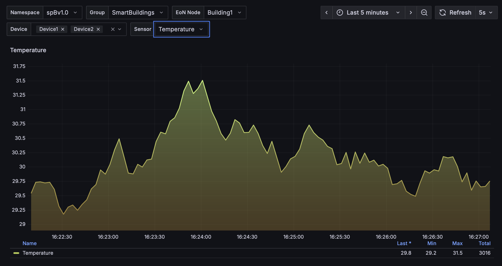

# Smart Buildings powered by SparkplugB, Aklivity Zilla, and Kafka

This demo showcases a Smart Building Industrial IoT (IIoT) architecture powered by SparkplugB MQTT, Zilla, and Apache Kafka to deliver real-time data streaming and visualization.

Sensor-equipped devices in multiple buildings transmit data to SparkplugB Edge of Network (EoN) nodes, which forward it via MQTT to Zilla.

Zilla seamlessly bridges these MQTT streams to Kafka, enabling downstream integration with Node-RED, InfluxDB, and Grafana for processing, storage, and visualization.


## Architecture

- Emulated Devices contains these four simulated IoT sensors
  - Temperature
  - Humidity
  - CO2
  - LightLevel
- Devices send data to SparkplugB EoN Nodes.
- Zilla receives MQTT streams from EoN nodes and bridges them to Kafka topics.
- Node-RED visualizes SparkplugB message flow and enables automation via Zilla.
- Grafana visualizes real-time and historical trends.

## Build the stack

Build the images from scratch (ignores cache):

```bash
docker-compose build --no-cache
```

## Start the stack

Launch all services in the background:

```bash
docker compose up --wait
```

```
[+] Running 16/16
 ✔ Network smart-buildings_kafka-net                                                                                   Created
 ✔ Network smart-buildings_main-net                                                                                    Created
 ✔ Network smart-buildings_spB-net                                                                                     Created
 ✔ Network smart-buildings_nodered-net                                                                                 Created
 ✔ Container influxdb                                                                                                  Healthy
 ✔ Container kafka                                                                                                     Healthy
 ✔ Container kafka-ui                                                                                                  Started
 ✔ Container kafka-init                                                                                                Exited 
 ✔ Container grafana                                                                                                   Started
 ✔ Container mqtt                                                                                                      Healthy
 ✔ Container nodered                                                                                                   Healthy
 ✔ Container eonNodeBuilding1                                                                                          Started
 ✔ Container eonNodeBuilding2                                                                                          Started     
 ✔ Container prometheus                                                                                                Started
 ```

## Service Endpoints

| Service                    | URL / Address                                    | Notes                          |
|----------------------------| ------------------------------------------------ | ------------------------------ |
| **Zilla MQTT**             | `mqtt://localhost:1883`                          | MQTT endpoint                  |
| **Zilla MQTT (WebSocket)** | `ws://localhost:8083/`                           | MQTT over WebSocket            |
| **Kafka UI**               | [http://localhost:8081/](http://localhost:8081/) | Manage Kafka topics & messages |
| **Node-RED**               | [http://localhost:1880/](http://localhost:1880/) | SparkplugB flow visualization  |
| **Grafana**                | [http://localhost:3000/](http://localhost:3000/) | Dashboard visualization        |

Note: Grafana credentials are `admin`/`mypasswordmypasswordmypassword`.

Using [`NodeRed`](http://localhost:1880/), we can send several commands to the EoN node and its devices in Building 1 & 2.


## Dashboard visualization



## Stop the stack

Shut down and clean up resources:

```bash
docker compose down
```
