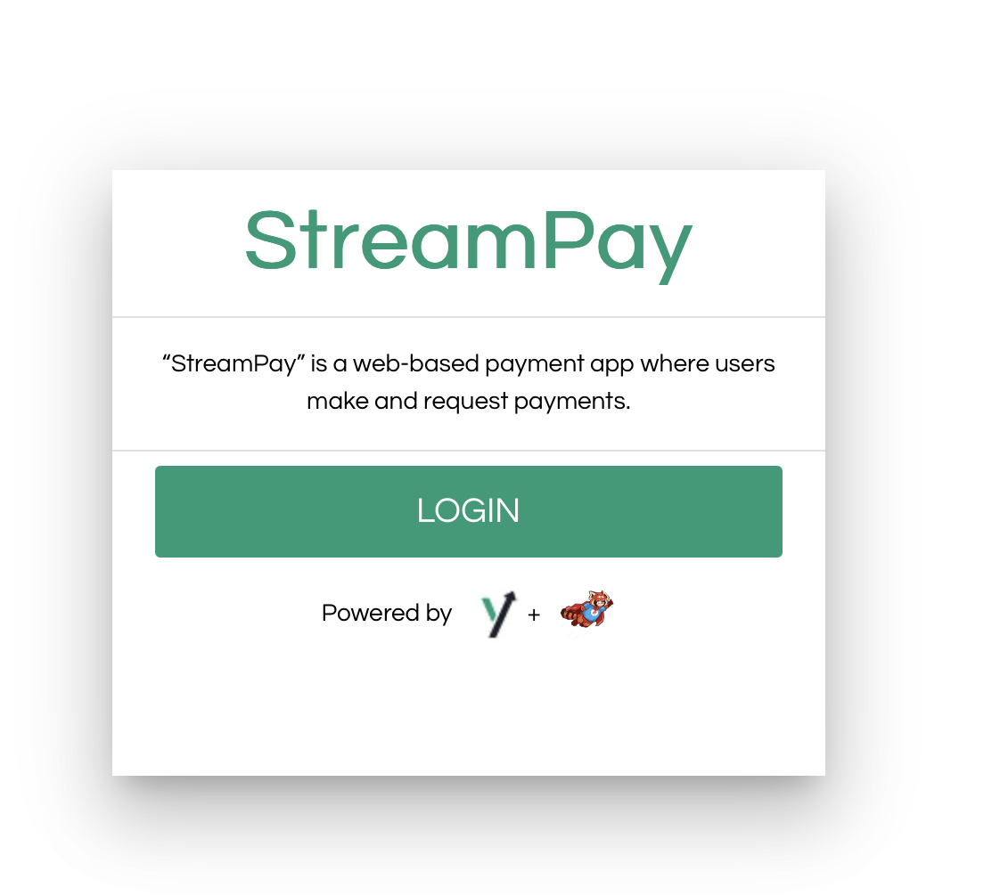

# StreamPay App Demo
This StreamPay app demo consists of 4 main components such as:

- Redpanda.
- Redpanda Console.
- Event processing service written using `Spring Boot`.
- Zilla API Gateway that hosts both app web interface and APIs.
- StreamPay app UI

## Requirements

* [Node.js](http://nodejs.org/)
* [Docker](https://www.docker.com/)


## Redpanda
Redpanda serves both as event streaming source and database table to store information about users, transactions,
and stats. Following topics are created:
- `commands` - This topics get populated by Zilla API Gateway and responsible for processing commands
such as `PayCommand`, `RequestCommand`.
- `replies` - HTTP response for processed command should be posted to this topic for correlated response.
- `transactions` - Stores information about about each transaction between users.
- `activities` - Event sourcing topic that logs all the activities in the system between users.
- `balances` - Tracks latest balance of a user comping from transactions table.
- `payment-requests` - Store payments requested by the user.
- `users` - Stores information about users(logcompacted topic).

## Redpanda Console
Redpanda Console is a developer-friendly UI for managing your Kafka/Redpanda workloads. Console gives you a simple,
interactive approach for gaining visibility into your topics, masking data, managing consumer groups, and exploring 
real-time data with time-travel debugging. You can access it at http://localhost:8080.

## Event Processing Service
This service responsible for processing commands such as `PayCommand`, `RequestCommand` and producing messages
to the appropriate topics. It also has statistic topologies that builds activities, statistics out of topics such as
`transactions`, and `payment-requests`

### Build the service
All components are launched from docker stack defined in `stack.yaml`, however, `streampay-stream` and `streampay-simulation`
services which have reference to `image: "streampay-stream:develop-SNAPSHOT"` and `image: "streampay-simulation:develop-SNAPSHOT`
should be built locally. Please run the below command to build the images.

```shell
cd extras-containers/streampay/service
./mvnw clean install
cd stream
docker build -t streampay-stream:develop-SNAPSHOT . --platform linux/x86_64
cd ..
cd simulation
docker build -t streampay-simulation:develop-SNAPSHOT . --platform linux/x86_64
```
The above command generates `streampay-stream:develop-SNAPSHOT` and `streampay-simulation:develop-SNAPSHOT` images.

## StreamPay UI
This app is build using `Vue.js` and `Quasar` frameworks and contains user authentication component as well
which uses Auth0 platform.

### Build

```shell
cd ../../ui/
npm i -g @quasar/cli
npm install
quasar build
cd ../../../streampay/stack/
```

The above command generates `dist` folder with all the necessary files to be hosted by Zilla API Gateway.

## Zilla API Gateway
Zilla API Gateway hosts both app UI and APIs. Following endpoints are configured in `zilla.jon`

| Protocol | Method | Endpoint              | Topic                |
|----------|--------|-----------------------|----------------------|
| SSE      | GET    | /activities           | activities           |
| SSE      | GET    | /payment-requests     | payment-requests     |
| SSE      | GET    | /current-balance      | balances             |
| SSE      | GET    | /total-transactions   | total-transactions   |
| SSE      | GET    | /average-transactions | average-transactions |
| SSE      | GET    | /balance-histories    | balance-histories    |
| HTTP     | POST   | /pay                  | commands             |
| HTTP     | POST   | /request              | commands             |
| HTTP     | PUT    | /current-user         | users                |
| HTTP     | GET    | /users                | users                |


## Launch the stack
Run following command to launch the docker compose stack:

```shell
docker compose up -d
```

```shell
#Output
[+] Running 7/7
 ✔ Network stack_net0                      Created             0.2s
 ✔ Container stack-streampay-stream-1      Started             1.0s
 ✔ Container stack-zilla-1                 Started             1.0s
 ✔ Container stack-redpanda-1              Started             1.1s
 ✔ Container stack-streampay-simulation-1  Started             1.0s
 ✔ Container stack-redpanda-console-1      Started             1.5s
 ✔ Container stack-init-redpanda-1         Started             1.4s
 ```

# Test

Navigate to `http://localhost:8081` in the browser.



Click on login and use one of the option to authenticate. Happy testing!
