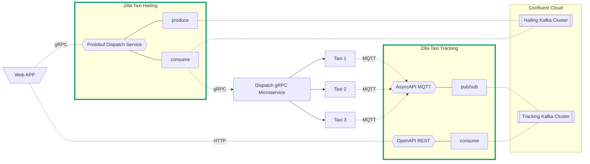

aws eks update-kubeconfig --name zilla-demos

kubectl exec --stdin --tty zilla-5fd95bfdcd-q2w4v -n taxi-demo -- /bin/bash

k config use-context docker-desktop

k describe pods -l app.kubernetes.io/instance=zila -n taxi-demo
k describe pods -l app.kubernetes.io/instance=zila -n taxi-demo
k logs -f -l app.kubernetes.io/instance=zilla --all-containers -n petstore
k logs -f -l app.kubernetes.io/instance=dispatch-service --all-containers -n taxi-demo
k logs -f -l pod/zilla-5fd95bfdcd-q2w4v --all-containers -n taxi-demo

kubectl exec --stdin --tty zilla-5c7fc889bf-qbtln -n taxi-demo -- /bin/bash

kubectl cp zilla-5c7fc889bf-qbtln:/var/run/zilla ./zilla_dump -n taxi-demo

k rollout restart deployment zilla -n taxi-demo
k rollout restart deployment dispatch-service -n taxi-demo
k rollout restart deployment dispatch-service-busses -n taxi-demo

- might need for public protection
kubectl apply -f https://raw.githubusercontent.com/nginxinc/kubernetes-ingress/v3.4.3/deploy/crds.yaml

curl -fsSL -o get_helm.sh https://raw.githubusercontent.com/helm/helm/main/scripts/get-helm-3
chmod 700 get_helm.sh
./get_helm.sh

## Improvements

- clarify validate on fetch vs produce
- metrics in multi namespace zilla files
- add zilla specific prefix to metric names
- don't send 404 on token failure but ok on scope failure
- topic that is deleting by time is not remove
- swaggar.io petstore caching
- preserve zilla generated files on restart
- add configurable version number in zilla config and pull from specs
- outgoing connection status metrics
- 
- don't send 404 on token failure but ok onscope failure
- Multi instance zilla testing and examples, min 2
- add std out to all examples

helm:

- sse auto start on last message id
- mqtt consumer by namespace

file a ticket with QoL improvements for helm chart

- update `_helpers.tpl` and use params
- ingress/serviceAccount option
- env var map extraEnvMap
- dedicated local file configmap options with dynamic naming
- 
- option to enable http2 by default from an ingress controller
- Zilla config as an ingress crontroller
- Zilla config as a sidecar

- zilla.yaml checksum
- zilla.yaml configmap name
- remove `$` in logs
- running zilla in a replica set of `3` caused grpc to deliver 3 message to the remote grpc service
  - sometimes zilla wouldn't deliver the request message
  - running multiple zilla would deliver multiple request message
- the kafka-grpc binding on a single zilla instance sometimes doesn't recognize there is a message it needs to send

mqtt:

- don't disconnect client when subscribe address is wrong
- generate uses `*` as wildcard instead of `+`
- generate adds trailing `0`s, perhaps don't add trailing number unless greater than `0`
- busses stop after a while

OpenAPI spec:

- Create individual messages from a list input
  operationId: createUsersWithListInput
- filter by properties
  operationId: findPetsByStatus
  operationId: findPetsByTags

support sasl config:
      x-sasl.jaas.config: >-
        org.apache.kafka.common.security.plain.PlainLoginModule required
        username="<CLUSTER_API_KEY>" password="<CLUSTER_API_SECRET>";
      x-security.protocol: SASL_PLAINTEXT
      x-sasl.mechanism: PLAIN

## End User API Migration Video | rough draft

- Start with Petstore OpenAPI spec only includes basic pet crud
- All specs are stored in a registry with appropriate versions for models and specs
- Describe use case to expand api spec scope to include managing Stores and Owners
- Modify both OpenAPI and AsyncAPI specs accordingly in some kind of UI or 3rd party tool
- Publish new versions of specs and models to a registry
- Update Zilla to use new models in a test environment, manual or automated
- Improve the Owner creation API to include some kind of async verification step
- Redeploy changes to test environment
- Demonstrate everything working
- Promote to a production environment
- Verify changes all work

Zilla components
- openapi
- openapi-asyncapi
- asyncapi
- model version updates
- versioning zilla schemas or detecting model version changes

## Todo

- grafana dashboard
- add more complicated version of diagram
  - kafka rest proxy
  - rest browser backend
  - mqtt broker
  - kafka connect sync and source
- same openapi picture for petstore
- DNS
- London bars
- record example demo walkthrough
- add resource links to the map ui
- review and update documentation
  - taxi demo ui has link to github and quick refs
  - github readme has demo instructions and links
  - docs link direct to live demo
  - add dedicated async/open api section in docs
- Kadeck local rest proxy feature with asyncapi definition
- upgrade the aiven helsinky demo and modify the taxi demo to include live data

### Full Diagram

2024-03-12 18:32:47 [client] mqtt-sessions[0] PRODUCE aborted (stopped
2024-03-12 18:32:47 org.agrona.concurrent.AgentTerminationException: java.util.IllegalFormatConversionException: d != io.aklivity.zilla.runtime.engine.internal.stream.Target$$Lambda/0x0000000100504f18
2024-03-12 18:32:47     at io.aklivity.zilla.runtime.engine@0.9.70/io.aklivity.zilla.runtime.engine.internal.registry.EngineWorker.doWork(EngineWorker.java:766)
2024-03-12 18:32:47     at org.agrona.core/org.agrona.concurrent.AgentRunner.doDutyCycle(AgentRunner.java:291)
2024-03-12 18:32:47     at org.agrona.core/org.agrona.concurrent.AgentRunner.run(AgentRunner.java:164)
2024-03-12 18:32:47     at java.base/java.lang.Thread.run(Thread.java:1583)
2024-03-12 18:32:47 Caused by: java.util.IllegalFormatConversionException: d != io.aklivity.zilla.runtime.engine.internal.stream.Target$$Lambda/0x0000000100504f18
2024-03-12 18:32:47     at java.base/java.util.Formatter$FormatSpecifier.failConversion(Formatter.java:4515)
2024-03-12 18:32:47     at java.base/java.util.Formatter$FormatSpecifier.printInteger(Formatter.java:3066)
2024-03-12 18:32:47     at java.base/java.util.Formatter$FormatSpecifier.print(Formatter.java:3021)
2024-03-12 18:32:47     at java.base/java.util.Formatter.format(Formatter.java:2791)
2024-03-12 18:32:47     at java.base/java.io.PrintStream.implFormat(PrintStream.java:1367)
2024-03-12 18:32:47     at java.base/java.io.PrintStream.format(PrintStream.java:1346)
2024-03-12 18:32:47     at io.aklivity.zilla.runtime.binding.kafka@0.9.70/io.aklivity.zilla.runtime.binding.kafka.internal.stream.KafkaClientProduceFactory$KafkaProduceStream$KafkaProduceClient.onNetworkAbort(KafkaClientProduceFactory.java:1420)
2024-03-12 18:32:47     at io.aklivity.zilla.runtime.binding.kafka@0.9.70/io.aklivity.zilla.runtime.binding.kafka.internal.stream.KafkaClientProduceFactory$KafkaProduceStream$KafkaProduceClient.onNetwork(KafkaClientProduceFactory.java:1313)
2024-03-12 18:32:47     at io.aklivity.zilla.runtime.engine@0.9.70/io.aklivity.zilla.runtime.engine.internal.registry.EngineWorker.handleReadReply(EngineWorker.java:1314)
2024-03-12 18:32:47     at io.aklivity.zilla.runtime.engine@0.9.70/io.aklivity.zilla.runtime.engine.internal.registry.EngineWorker.handleRead(EngineWorker.java:1108)
2024-03-12 18:32:47     at io.aklivity.zilla.runtime.engine@0.9.70/io.aklivity.zilla.runtime.engine.internal.concurent.ManyToOneRingBuffer.read(ManyToOneRingBuffer.java:181)
2024-03-12 18:32:47     at io.aklivity.zilla.runtime.engine@0.9.70/io.aklivity.zilla.runtime.engine.internal.registry.EngineWorker.doWork(EngineWorker.java:760)
2024-03-12 18:32:47     ... 3 more
2024-03-12 18:32:47     Suppressed: java.lang.Exception: [engine/data#3]        [0x03030000000001fc] streams=[consumeAt=0x001bdc38 (0x00000000001bdc38), produceAt=0x001bdc38 (0x00000000001bdc38)]
2024-03-12 18:32:47             at io.aklivity.zilla.runtime.engine@0.9.70/io.aklivity.zilla.runtime.engine.internal.registry.EngineWorker.doWork(EngineWorker.java:764)
2024-03-12 18:32:47             ... 3 more

org.agrona.concurrent.AgentTerminationException: java.lang.NullPointerException: Cannot invoke "io.aklivity.zilla.runtime.binding.kafka.internal.types.KafkaEvaluation.ordinal()" because "evaluation" is null
    at io.aklivity.zilla.runtime.engine@0.9.70/io.aklivity.zilla.runtime.engine.internal.registry.EngineWorker.doWork(EngineWorker.java:766)
    at org.agrona.core/org.agrona.concurrent.AgentRunner.doDutyCycle(AgentRunner.java:291)
    at org.agrona.core/org.agrona.concurrent.AgentRunner.run(AgentRunner.java:164)
    at java.base/java.lang.Thread.run(Thread.java:1583)
Caused by: java.lang.NullPointerException: Cannot invoke "io.aklivity.zilla.runtime.binding.kafka.internal.types.KafkaEvaluation.ordinal()" because "evaluation" is null
    at io.aklivity.zilla.runtime.binding.kafka@0.9.70/io.aklivity.zilla.runtime.binding.kafka.internal.cache.KafkaCacheCursorFactory.asCondition(KafkaCacheCursorFactory.java:1143)
    at io.aklivity.zilla.runtime.binding.kafka@0.9.70/io.aklivity.zilla.runtime.binding.kafka.internal.stream.KafkaCacheClientFetchFactory.newStream(KafkaCacheClientFetchFactory.java:242)
    at io.aklivity.zilla.runtime.binding.kafka@0.9.70/io.aklivity.zilla.runtime.binding.kafka.internal.stream.KafkaCacheClientFactory.newStream(KafkaCacheClientFactory.java:149)
    at io.aklivity.zilla.runtime.engine@0.9.70/io.aklivity.zilla.runtime.engine.internal.registry.EngineWorker.handleBeginInitial(EngineWorker.java:1449)
    at io.aklivity.zilla.runtime.engine@0.9.70/io.aklivity.zilla.runtime.engine.internal.registry.EngineWorker.handleDefaultReadInitial(EngineWorker.java:1217)
    at io.aklivity.zilla.runtime.engine@0.9.70/io.aklivity.zilla.runtime.engine.internal.registry.EngineWorker.handleReadInitial(EngineWorker.java:1157)
    at io.aklivity.zilla.runtime.engine@0.9.70/io.aklivity.zilla.runtime.engine.internal.registry.EngineWorker.handleRead(EngineWorker.java:1104)
    at io.aklivity.zilla.runtime.engine@0.9.70/io.aklivity.zilla.runtime.engine.internal.concurent.ManyToOneRingBuffer.read(ManyToOneRingBuffer.java:181)
    at io.aklivity.zilla.runtime.engine@0.9.70/io.aklivity.zilla.runtime.engine.internal.registry.EngineWorker.doWork(EngineWorker.java:760)
    ... 3 more
    Suppressed: java.lang.Exception: [engine/data#3]        [0x030300000000023b] streams=[consumeAt=0x0012fab0 (0x000000000212fab0), produceAt=0x0012fc80 (0x000000000212fc80)]
            at io.aklivity.zilla.runtime.engine@0.9.70/io.aklivity.zilla.runtime.engine.internal.registry.EngineWorker.doWork(EngineWorker.java:764)
            ... 3 more
