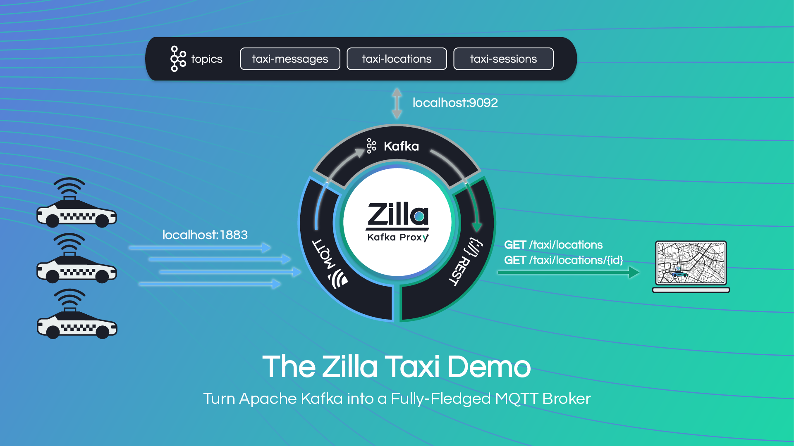
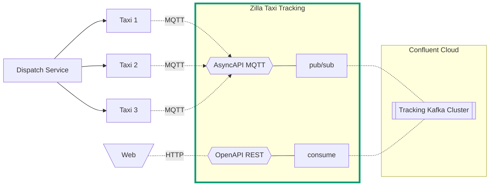

# Taxi Demo

[Live Demo](https://taxi.aklivity.io/)

This demo showcases the MQTT and REST protocols proxied to Kafka by Zilla. Zilla is using [OpenAPI](https://www.openapis.org/) and [AsyncAPI](https://www.asyncapi.com/) spec definitions to generate the necessary proxy config. The demo uses [Open Street Maps](https://www.openstreetmap.org/), [Open Route Service](https://openrouteservice.org/), and the [MQTT Simulator](https://github.com/DamascenoRafael/mqtt-simulator) to demonstrate a real-world taxi-hailing and location tracking service.



## Using the Taxi UI

The [Taxi Map UI](https://taxi.aklivity.io/) highlights downtown San Jose, CA bars. You can hail a taxi to simulate traveling to each destination. Some shuttle buses also run routes to the bars and make permanent round trips.

- Clicking on one of the bar markers lets you hail a taxi
- The hailed taxi will "pick up" the passenger at the San Jose, CA Convention center
- The taxi will then proceed to the designated location on the map and stop sending location updates


## Using the Demo

1. This demo has multiple taxi/bus IoT clients publishing location updates to Kafka using Zilla as the MQTT broker.
1. The red Bar markers indicate destinations and the green Vehicle markers represent the taxi/bus IoT clients.
1. Use the [Taxi Map UI](https://taxi.aklivity.io/) and click on a bar icon to "Hail a Taxi".
1. The map will show the route and the hailed taxi following it. You can use the "Clear Route" button in the sidebar or click the Aklivity logo to see the full map.
1. Open the [Kafka UI](https://taxi.aklivity.io/kafka/ui/clusters/taxi-demo/all-topics/taxi-locations/messages?seekDirection=TAILING&seekType=LATEST) in `live` mode to see the taxi locations updates.
   1. Notice the MQTT topic includes the bar name in the key: `taxi/Fox_Tale_Ferm-86439137/location`.
   1. Each message is an individual location update with a new Lat Long coord.
   1. Once the taxi gets to the destination, it will stop sending new updates.
1. The [demo architecture](./demo-resources/arch-Taxi-Demo.md) is streamlined with Zilla.
   - No MQTT broker
   - No Kafka Connect
   - No web server
1. Zilla is proxying the MQTT and REST calls to the native Kafka protocol.
1. Use the [OpenAPI Editor](https://editor.swagger.io/) and [AsyncAPI Studio](https://studio.asyncapi.com/) to see the specs used to generate the [Zilla config](./zilla.yaml).
   - [Kafka AsyncAPI](./live-demo-deploytracking-kafka-asyncapi.yaml)
   - [MQTT AsyncAPI](./live-demo-deploytracking-mqtt-asyncapi.yaml)
   - [Taxi REST OpenAPI](./live-demo-deploy/tracking-openapi.yaml)
1. Now you know how Zilla's Design-first, API-native approach to integration will:
   - Reduce architecture and DevOps complexity
   - Accelerate developer velocity
   - Maximize the investment in Kafka

## Run the Demo

Demo architecture:



### Requirements

- [Docker Compose](https://docs.docker.com/compose/gettingstarted/)

### Setup

1. Start all of the services using `docker-compose`. The `startup.sh` script will `build` and `start` all the services. This command will also `restart` an existing stack.

   - You can run this demo with [Redpanda](https://docs.redpanda.com/current/reference/docker-compose/) by adding the `--redpanda` flag

   ```bash
   ./startup.sh
   ```

1. Use the local [Taxi UI](http://localhost/) for the demo.

### Data on Kafka / Redpanda

1. The Kafka topics are created during `startup`.
1. Browse the topics in the [Kafka UI](http://localhost:8080/).
   - The [Redpanda Console](http://localhost:8080/) is available instead if you specified the `--redpanda` flag.
1. You can browse the log compacted topic `taxi-locations` to see each location update from active taxis.
   - The `bus-locations` topic is all of the automatic updates that are routed by the zilla config
   - Zilla is using the other topics listed to manage the MQTT and gRPC bindings
1. The [Taxi UI](http://localhost/) pulls the most recent location for all of the unique taxis from Kafka.

### Load Testing

The mqtt-simulation service includes a `default_routes.json` file, which starts a looping set of routes used in the demo. An additional file, `default_routes_load_test.json`, is available, which leverages the simulator's ability to generate multiple topics.

1. You will see in the JSON file the config for managing the number of topics to generate by updating the `"RANGE_END"` value:

   ```json
   "TYPE": "multiple",
   "RANGE_START": 1,
   "RANGE_END": 500,
   ```

1. The `taxi-tracking-service` in the [docker-compose.yaml](docker-compose.yaml) file mounts the default config. Update the volume mount to map the load_test file.

   ```yaml
   volumes:
     - ./grpc/service/default_routes_load_test.json:/usr/src/app/default_routes.json
   ```

1. Ensure the `DEFAUlT_ROUTES` env var is `true` so the service will start the sim and the `PRINT_SIM_LOGS` is true so the container will print the simulator output.

   ```yaml
   environment:
     DEFAUlT_ROUTES: true
     PRINT_SIM_LOGS: true
   ```

1. Happy Load Testing!
