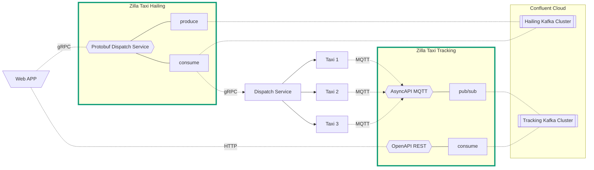

# Taxi Demo

This demo showcases the MQTT protocol brokered by Zilla. It uses [Open Street Maps](https://www.openstreetmap.org/), [Open Route Service](https://openrouteservice.org/), and the [MQTT Simulator](https://github.com/DamascenoRafael/mqtt-simulator) to demonstrate a real-world taxi-hailing and location tracking service.




## Requirements

- [Docker Compose](https://docs.docker.com/compose/gettingstarted/)

## Setup

1. Start all of the services using `docker-compose`. The `startup.sh` script will `build` and `start` all the services. This command will also `restart` an existing stack.

   - You can run this demo with [Redpanda](https://docs.redpanda.com/current/reference/docker-compose/) by adding the `--redpanda` flag

   ```bash
   ./startup.sh
   ```

   > This will take a long time to build the first time since it will need to download maven and npm packages.

1. Open the Open Street Maps [Taxi UI](http://localhost/). The map is centered on the San Jose Convention Center.
1. A collection of bars shows on the map; click a bar.
1. Click "Hail a Taxi" to set the destination, with the San Jose Convention Center being the origin.
1. A Taxi marker will appear along the route, and travel along it for the duration shown in the popup.
1. You can use the "Clear Route" button in the sidebar or click the Aklivity logo to see the full map.
1. The best setup is to have one tab open with the sidebar and one tab for showing the full map.

## Using the Taxi UI

The [Taxi UI](http://localhost/) highlights downtown San Jose, CA bars. Users can hail taxis to take them to these locations. Some shuttle buses also run routes to the bars and make permanent round trips.

- Clicking on one of the bar markers lets you hail a taxi
- The hailed taxi will "pick up" the passenger at the San Jose, CA Convention center
- The taxi will then proceed to the designated location on the map and stop sending location updates


## Run through

1. Introduce the taxi demo. It has multiple taxi clients publishing location updates to Kafka using Zilla as an MQTT broker.
1. Walkthrough architecture slide
   1. Cover all different parts of the setup
      - Use the Diagram to describe the architecture
      - Describe the data flow through Zilla using the MQTT protocol
   1. Highlight what to note as running through the demo
      - Moving taxi/bus icons
      - Ask for input to select a new route
1. Show the demo explaining what is happening at each step
   1. Map UI and Hail a Taxi function
   1. Show the `taxi-location` topic in the [Kafka UI](http://localhost:8080/) with the latest message key being a destination
1. End the demo by bringing up the architecture slide summarizing outcomes and highlighting Zilla benefits.

## Data on Kafka / Redpanda

1. The Kafka topics are created during `startup`.
1. Browse the topics in the [Kafka UI](http://localhost:8080/).
   - The [Redpanda Console](http://localhost:8080/) is available instead if you specified the `--redpanda` flag.
1. You can browse the log compacted topic `taxi-locations` to see each location update from active taxis.
   - The `bus-locations` topic is all of the automatic updates that are routed by the zilla config
   - Zilla is using the other topics listed to manage the MQTT and gRPC bindings
1. The [Taxi UI](http://localhost/) pulls the most recent location for all of the unique taxis from Kafka.

## Load Testing

The mqtt-simulation service includes a `default_routes.json` file, which starts a looping set of routes used in the demo. An additional file, `default_routes_load_test.json`, is available, which leverages the simulator's ability to generate multiple topics.

1. You will see in the JSON file the config for managing the number of topics to generate by updating the `"RANGE_END"` value:

   ```json
   "TYPE": "multiple",
   "RANGE_START": 1,
   "RANGE_END": 500,
   ```

1. The `taxi-tracking-service` in the [docker-compose.yaml](docker-compose.yaml) file mounts the default config. Update the volume mount to map the load_test file.

   ```yaml
   volumes:
     - ./grpc/service/default_routes_load_test.json:/usr/src/app/default_routes.json
   ```

1. Ensure the `DEFAUlT_ROUTES` env var is `true` so the service will start the sim and the `PRINT_SIM_LOGS` is true so the container will print the simulator output.

   ```yaml
   environment:
     DEFAUlT_ROUTES: true
     PRINT_SIM_LOGS: true
   ```

1. Happy Load Testing!
