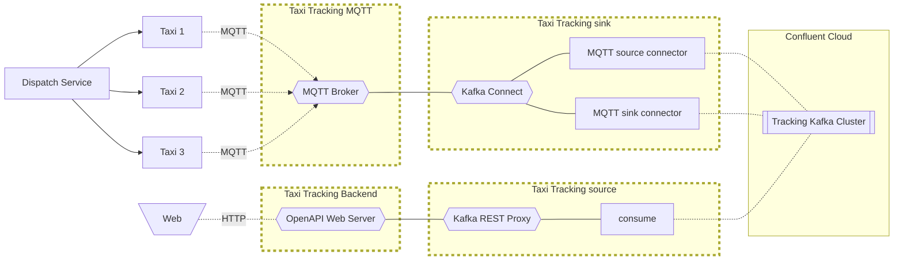
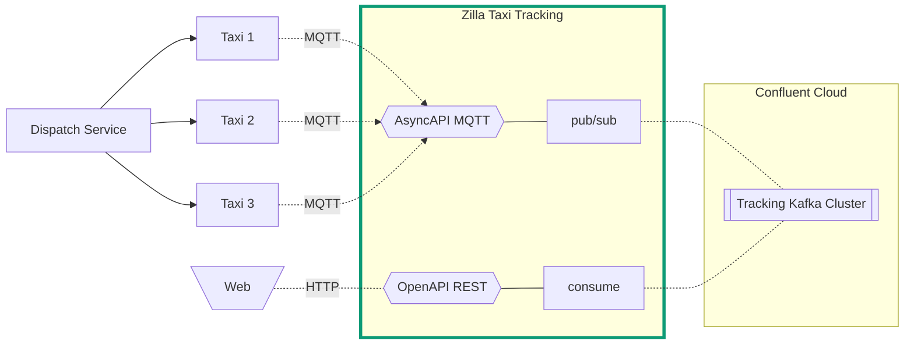
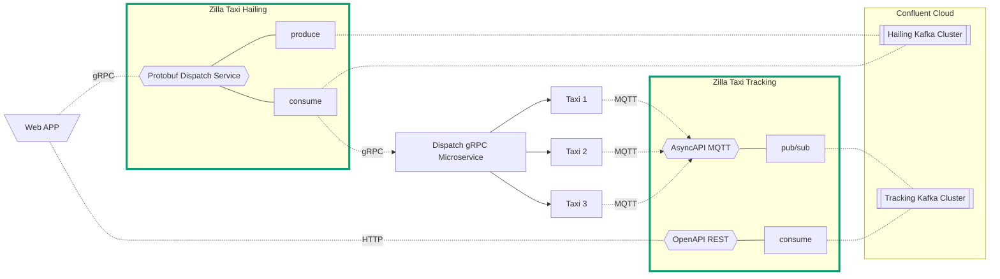

# Taxi Demo Architecture Diagram

## Without Zilla

```mermaid
flowchart LR
    style app1 stroke-dasharray: 5 5,stroke-width:4px
    style app2 stroke-dasharray: 5 5,stroke-width:4px
    style app3 stroke-dasharray: 5 5,stroke-width:4px
    style app4 stroke-dasharray: 5 5,stroke-width:4px

    ui[\Web/] -.- |HTTP| thws

    subgraph app2 [Taxi Tracking source]
            krp{{Kafka REST Proxy}} --- gsource[consume]
    end

    subgraph app1 [Taxi Tracking Backend]
            thws{{OpenAPI Web Server}} --- krp
    end

    tsgrpc[Dispatch Service]
    tsgrpc --> ttiot[Taxi 1] & ttiotb[Taxi 2] & ttiotc[Taxi 3]

    subgraph app3 [Taxi Tracking sink]
            mqttkc{{Kafka Connect}} --- ksink[MQTT sink connector] & ksource[MQTT source connector]
    end

    subgraph app4 [Taxi Tracking MQTT]
            mqttb{{MQTT Broker}} --- mqttkc
    end

    ttiot & ttiotb & ttiotc -.-> |MQTT| mqttb

    subgraph cc [Confluent Cloud]
        cciot[[Tracking Kafka Cluster]]
        ksource -.- cciot
        ksink -.- cciot
        gsource -.- cciot
    end
```

## With Zilla

```mermaid
flowchart LR
    style zilla1 stroke:#0d9b76,stroke-width:4px

    tsgrpc[Dispatch Service] --> ttiot[Taxi 1] & ttiotb[Taxi 2] & ttiotc[Taxi 3]

    tmuisr[\Web/] -.- |HTTP| ztos

    subgraph zilla1 [Zilla Taxi Tracking]
            ztos{{OpenAPI REST}} --- ztoc[consume]
            ztas{{AsyncAPI MQTT}} --- ztapc[pub/sub]
    end

    ttiot & ttiotb & ttiotc -.-> |MQTT| ztas

    subgraph cc [Confluent Cloud]
        cciot[[Tracking Kafka Cluster]]
        ztapc -.- cciot
        ztoc -.- cciot
    end
```

### Full Diagram

```mermaid
flowchart LR
    style app1 stroke:#0d9b76,stroke-width:4px
    style app2 stroke:#0d9b76,stroke-width:4px

    tmuisr[\Web APP/] -.- |gRPC| zhgs
    subgraph app1 [Zilla Taxi Hailing]
            zhgs{{Protobuf Dispatch Service}}
            zhgs --- zhig[consume]
            zhgs --- zheg[produce]
    end

    zhig -.-> |gRPC| tsgrpc[Dispatch gRPC Microservice]
    tsgrpc --> ttiot[Taxi 1] & ttiotb[Taxi 2] & ttiotc[Taxi 3]

    tmuisr -.- |HTTP| ztos

    subgraph app2 [Zilla Taxi Tracking]
            ztos{{OpenAPI REST}} --- ztoc[consume]
            ztas{{AsyncAPI MQTT}} --- ztapc[pub/sub]
    end

    ttiot & ttiotb & ttiotc -.-> |MQTT| ztas

    subgraph cc [Confluent Cloud]
        ccsm[[Hailing Kafka Cluster]]
        zheg -.- ccsm
        zhig -.- ccsm
        cciot[[Tracking Kafka Cluster]]
        ztapc -.- cciot
        ztoc -.- cciot
    end
```
