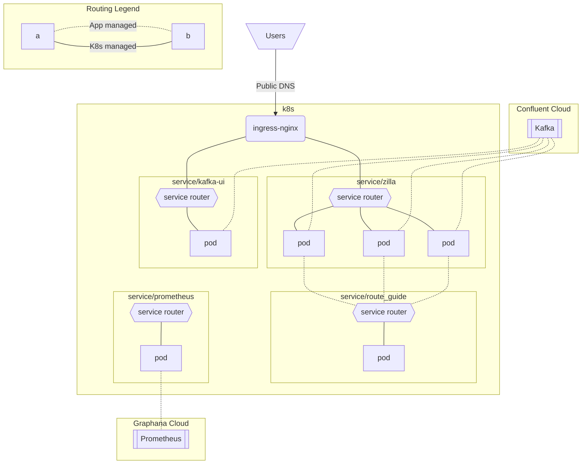

# Zilla gRPC Proxy on K8s

This demo deploys a gRPC proxy with Zilla to a K8s cluster with a public endpoint. The storage layer is a SASL/SCRAM auth Kafka provider. Metrcis are scrapped and pushed to a public prometheus instance.



## Installing

- Create a `.env` file or export the below variables.

    ```text
    NAMESPACE=
    KAFKA_BOOTSTRAP=
    KAFKA_USER=
    KAFKA_PASS=
    PROM_PASS=
    ```

- Set your desired k8s cluster config.
- Install all of the services with the setup script.

    ```shell
    ./setup.sh
    ```

- You can use this deployment with the gRPC-Proxy endpoints in the [Zilla Quickstart](https://docs.aklivity.io/zilla/latest/tutorials/quickstart/kafka-proxies.html#postman-collections).
- Uninstall all of the services with the teardown script.

    ```shell
    ./teardown.sh
    ```
