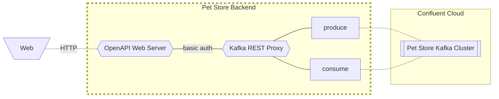
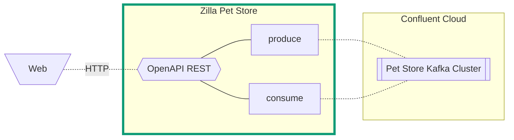

# Pet Store Architecture Diagram

## Without Zilla

```mermaid
flowchart LR
    style app1 stroke-dasharray: 5 5,stroke-width:4px

    ui[\Web/] -.- |HTTP| psws

    subgraph app1 [Pet Store Backend]
            psws{{OpenAPI Web Server}} --- | basic auth | krp
            krp{{Kafka REST Proxy}} --- krpp[produce] & krpc[consume]
    end

    subgraph cc [Confluent Cloud]
        ccps[[Pet Store Kafka Cluster]]
        krpp -.- ccps
        krpc -.- ccps
    end
```

## With Zilla

```mermaid
flowchart LR
    style app1 stroke:#0d9b76,stroke-width:4px

    ui[\Web/] -.- |HTTP| zpsos

    subgraph app1 [Zilla Pet Store]
            zpsos{{OpenAPI REST}} --- zpp[produce] & zpc[consume]
    end

    subgraph cc [Confluent Cloud]
        ccps[[Pet Store Kafka Cluster]]
        zpp -.- ccps
        zpc -.- ccps
    end
```

