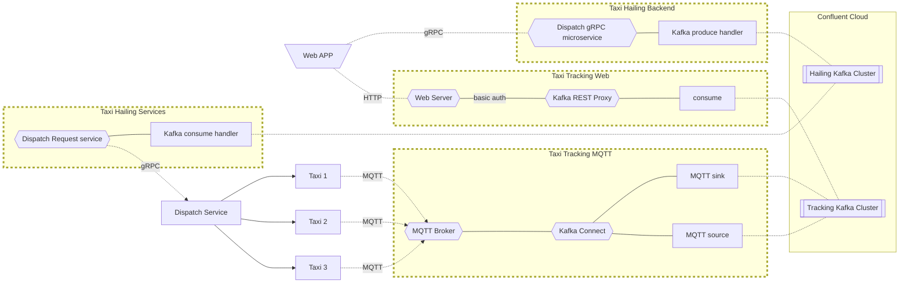
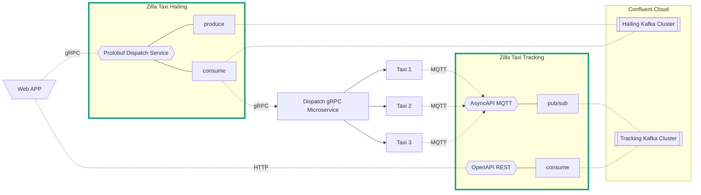
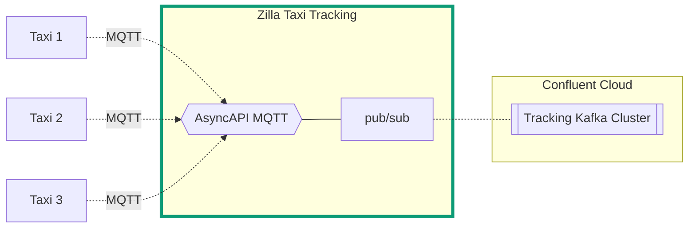
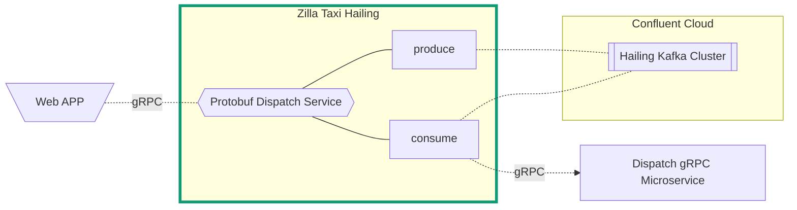

# Taxi Demo Architecture Diagram

## Without Zilla

```mermaid
flowchart LR
    style app1 stroke-dasharray: 5 5,stroke-width:4px
    style app2 stroke-dasharray: 5 5,stroke-width:4px
    style app3 stroke-dasharray: 5 5,stroke-width:4px
    style app4 stroke-dasharray: 5 5,stroke-width:4px

    tmuisr[\Web APP/] -.- |gRPC| thgms

    subgraph app1 [Taxi Hailing Backend]
            thgms{{Dispatch gRPC microservice}} --- kph[Kafka produce handler]
    end
    subgraph app2 [Taxi Hailing Services]
            thdrs{{Dispatch Request service}} --- kch[Kafka consume handler]
    end

    thdrs -.-> |gRPC| tsgrpc[Dispatch Service]
    tsgrpc --> ttiot[Taxi 1] & ttiotb[Taxi 2] & ttiotc[Taxi 3]

    tmuisr -.- |HTTP| ttws

    subgraph app3 [Taxi Tracking Web]
            ttws{{Web Server}} --- | basic auth | krp
            krp{{Kafka REST Proxy}} --- ttpc[consume]
    end

    subgraph app4 [Taxi Tracking MQTT]

            mqttb{{MQTT Broker}} --- mqttkc{{Kafka Connect}}
            mqttkc --- ksink[MQTT sink] & ksource[MQTT source]
    end

    ttiot & ttiotb & ttiotc -.-> |MQTT| mqttb

    subgraph cc [Confluent Cloud]
        ccsm[[Hailing Kafka Cluster]]
        kch -.- ccsm
        kph -.- ccsm
        cciot[[Tracking Kafka Cluster]]
        ksource -.- cciot
        ksink -.- cciot
        ttpc -.- cciot
    end
```

## With Zilla

```mermaid
flowchart LR
    style app1 stroke:#0d9b76,stroke-width:4px
    style app2 stroke:#0d9b76,stroke-width:4px

    tmuisr[\Web APP/] -.- |gRPC| zhgs
    subgraph app1 [Zilla Taxi Hailing]
            zhgs{{Protobuf Dispatch Service}}
            zhgs --- zhig[consume]
            zhgs --- zheg[produce]
    end

    zhig -.-> |gRPC| tsgrpc[Dispatch gRPC Microservice]
    tsgrpc --> ttiot[Taxi 1] & ttiotb[Taxi 2] & ttiotc[Taxi 3]

    tmuisr -.- |HTTP| ztos

    subgraph app2 [Zilla Taxi Tracking]
            ztos{{OpenAPI REST}} --- ztoc[consume]
            ztas{{AsyncAPI MQTT}} --- ztapc[pub/sub]
    end

    ttiot & ttiotb & ttiotc -.-> |MQTT| ztas

    subgraph cc [Confluent Cloud]
        ccsm[[Hailing Kafka Cluster]]
        zheg -.- ccsm
        zhig -.- ccsm
        cciot[[Tracking Kafka Cluster]]
        ztapc -.- cciot
        ztoc -.- cciot
    end
```

### Zilla MQTT

```mermaid
flowchart LR
    style app2 stroke:#0d9b76,stroke-width:4px

    subgraph app2 [Zilla Taxi Tracking]
            ztas{{AsyncAPI MQTT}} --- ztapc[pub/sub]
    end
    
    ttiot[Taxi 1] & ttiotb[Taxi 2] & ttiotc[Taxi 3] -.-> |MQTT| ztas

    subgraph cc [Confluent Cloud]
        cciot[[Tracking Kafka Cluster]]
        ztapc -.- cciot
    end
```

### Zilla gRPC

```mermaid
flowchart LR
    style app1 stroke:#0d9b76,stroke-width:4px

    tmuisr[\Web APP/] -.- |gRPC| zhgs
    subgraph app1 [Zilla Taxi Hailing]
            zhgs{{Protobuf Dispatch Service}}
            zhgs --- zhig[consume]
            zhgs --- zheg[produce]
    end

    zhig -.-> |gRPC| tsgrpc[Dispatch gRPC Microservice]


    subgraph cc [Confluent Cloud]
        ccsm[[Hailing Kafka Cluster]]
        zheg -.- ccsm
        zhig -.- ccsm
    end
```
