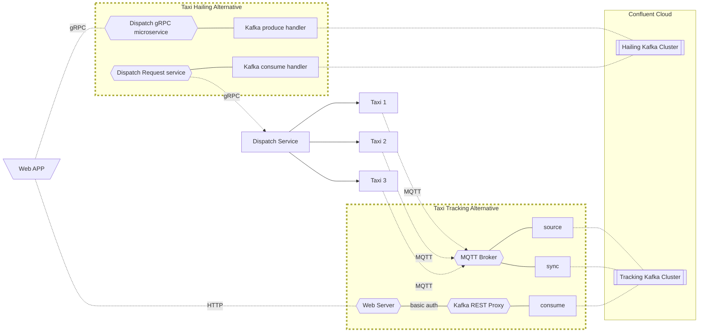
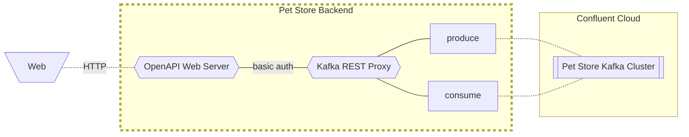

# Alternate Architecture Diagram

## Taxi Demo

```mermaid
flowchart LR
    style app1 stroke-dasharray: 5 5,stroke-width:4px
    style app2 stroke-dasharray: 5 5,stroke-width:4px

    tmuisr[\Web APP/] -.- |gRPC| thgms

    subgraph app1 [Taxi Hailing Alternative]
            
            thgms{{Dispatch gRPC microservice}} --- kph[Kafka produce handler]
            thdrs{{Dispatch Request service}} --- kch[Kafka consume handler]
    end

    thdrs -.-> |gRPC| tsgrpc[Dispatch Service]
    tsgrpc --> ttiot[Taxi 1] & ttiotb[Taxi 2] & ttiotc[Taxi 3]

    tmuisr -.- |HTTP| ttws

    subgraph app2 [Taxi Tracking Alternative]
            ttws{{Web Server}} --- | basic auth | krp
            krp{{Kafka REST Proxy}} --- ttpc[consume]

            mqttb{{MQTT Broker}} --- ksource[source]
            mqttb --- ksync[sync]
    end

    ttiot & ttiotb & ttiotc -.-> |MQTT| mqttb

    subgraph cc [Confluent Cloud]
        ccsm[[Hailing Kafka Cluster]]
        kph -.- ccsm
        kch -.- ccsm
        cciot[[Tracking Kafka Cluster]]
        ksource -.- cciot
        ksync -.- cciot
        ttpc -.- cciot
    end
```

## Pet Store

```mermaid
flowchart LR
    style app1 stroke-dasharray: 5 5,stroke-width:4px

    ui[\Web/] -.- |HTTP| psws

    subgraph app1 [Pet Store Backend]
            psws{{OpenAPI Web Server}} --- | basic auth | krp
            krp{{Kafka REST Proxy}} --- krpp[produce] & krpc[consume]
    end

    subgraph cc [Confluent Cloud]
        ccps[[Pet Store Kafka Cluster]]
        krpp -.- ccps
        krpc -.- ccps
    end
```
