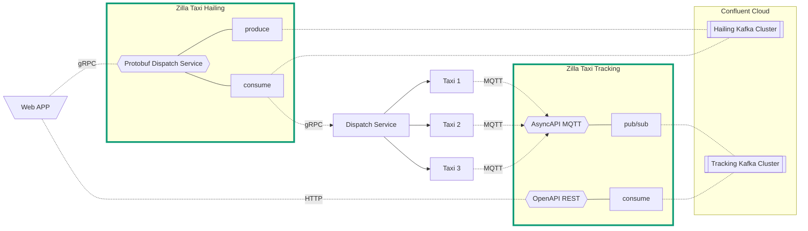

# Zilla Architecture Diagram

```mermaid
flowchart LR
    style app1 stroke:#0d9b76,stroke-width:4px
    style app2 stroke:#0d9b76,stroke-width:4px

    tmuisr[\Web APP/] -.- |gRPC| zhgs
    subgraph app1 [Zilla Taxi Hailing]
            zhgs{{Protobuf Dispatch Service}}
            zhgs --- zhig[consume]
            zhgs --- zheg[produce]
    end

    zhig -.-> |gRPC| tsgrpc[Dispatch Service]
    tsgrpc --> ttiot[Taxi 1] & ttiotb[Taxi 2] & ttiotc[Taxi 3]

    tmuisr -.- |HTTP| ztos

    subgraph app2 [Zilla Taxi Tracking]
            ztos{{OpenAPI REST}} --- ztoc[consume]
            ztas{{AsyncAPI MQTT}} --- ztapc[pub/sub]
    end

    ttiot & ttiotb & ttiotc -.-> |MQTT| ztas

    subgraph cc [Confluent Cloud]
        ccsm[[Hailing Kafka Cluster]]
        zheg -.- ccsm
        zhig -.- ccsm
        cciot[[Tracking Kafka Cluster]]
        ztapc -.- cciot
        ztoc -.- cciot
    end
```
