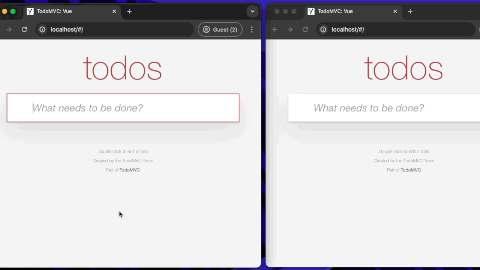
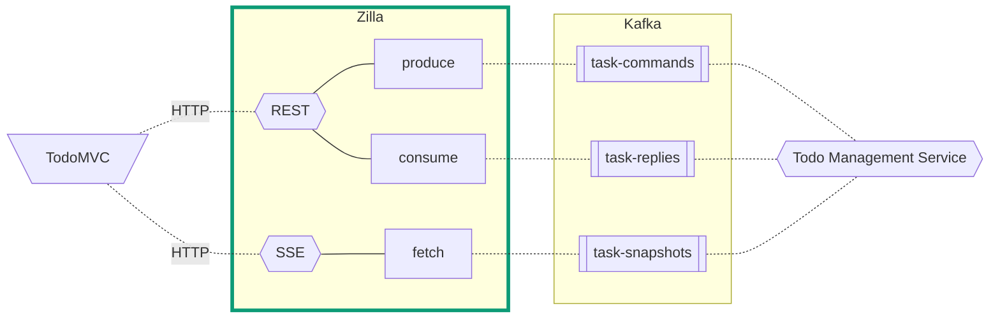
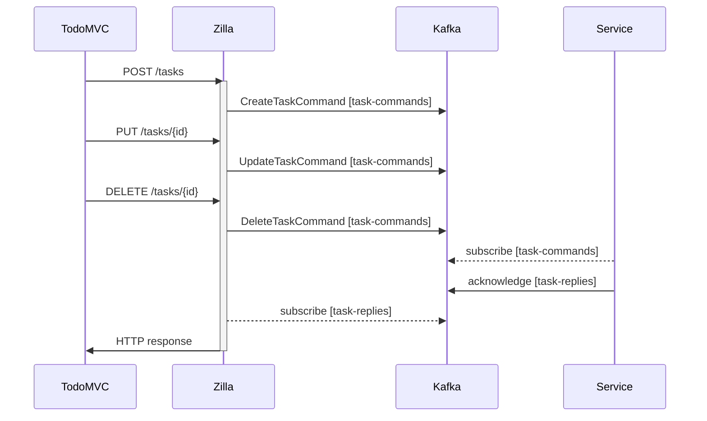
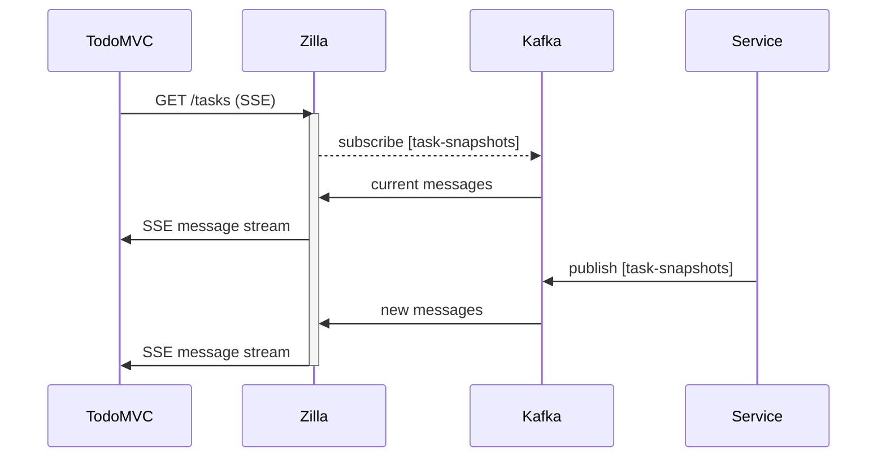

# TodoMVC CQRS Demo

This demo showcases a TodoMVC app that implements the [Command Query Responsibility Segregation (CQRS)](https://en.wikipedia.org/wiki/Command_Query_Responsibility_Segregation) architecture with the REST command APIs and an SSE query API created by Zilla.



## Using the Demo

- The TodoMVC UI lets you maintain a list of tasks across browsers and sessions.

  > 1. Type a new todo task in the provided text box and press `enter` to save it.
  > 1. Click on the circle next to a task to toggle its completion.
  > 1. Filter tasks by status with the controls on the bottom.
  > 1. Delete all completed tasks withe the `Clear completed` button.

- The TodoMVC UI sends state changes for tasks to Zilla as Commands to be executed by the Todo Management Service.
- The Todo Management Service will process each command and persist the new todo state.
- The TodoMVC UI sends a single Query to Zilla and gets a stream of task data.
- All changes happen in the Todo Management Service.
- There are NO state mutations in the browser.

### Requirements

- [Docker Compose](https://docs.docker.com/compose/gettingstarted/)

### Setup

1. Start all of the services using `docker-compose`. The `startup.sh` script will `build` and `start` all the services. This command will also `restart` an existing stack.

   ```bash
   ./startup.sh
   ```

   - You can also run this demo with [Redpanda](https://docs.redpanda.com/current/reference/docker-compose/).

   ```bash
   KAFKA_BROKER=redpanda ./startup.sh
   ```

1. Use the local [TodoMVC UI](http://localhost/) for the demo.
1. Browse the topics in the [Kafka UI](http://localhost:8080/).

### Data on Kafka / Redpanda

1. The Kafka topics are created during `startup`.
1. Browse the topics in the [Kafka UI](http://localhost:8080/).
1. The task commands are recorded on the `task-commands` topic with acknowledgement of the command recorded on the `task-replies` topic.
1. All of the task state updates are recorded on the `task-snapshots` topic.

## Todo CQRS

The task commands to Create, Update, and Delete todos are separated into the [Command](#command) endpoints declared in Zilla. The [Query](#query) endpoint is an SSE stream proxied from a kafka topic by Zilla.

### Services architecture



### Command

The todo Command sequence leverages Zilla to enable the command creation based on simple REST endpoints.

```yaml
      - when:
          - method: POST
            path: /tasks
            ...
            todo-command:operation: CreateTaskCommand
      - when:
          - method: PUT
            path: /tasks/{id}
            ...
            todo-command:operation: UpdateTaskCommand
      - when:
          - method: DELETE
            path: /tasks/{id}
            ...
            todo-command:operation: DeleteTaskCommand
```



### Query

Querying for todo updates becomes a simple HTTP GET on an the SSE endpoint which will contain every state change.


