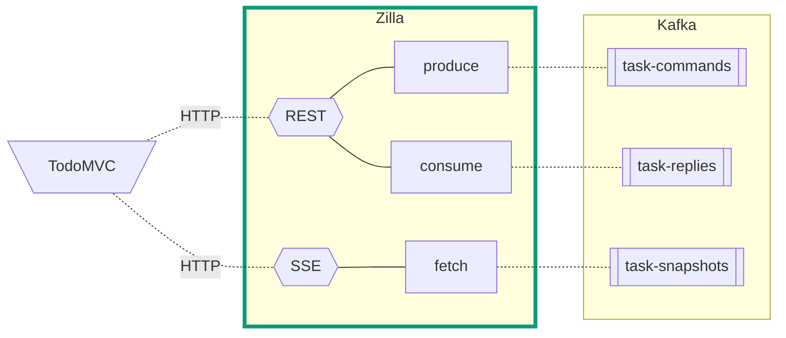

# TodoMVC CQRS Demo

This demo showcases the REST and SSE protocols proxied to Kafka by Zilla.


## Using the TodoMVC UI

The TodoMVC UI

- Clicking on one of the bar markers lets you hail a taxi


## Using the Demo

1. This demo has multiple taxi/bus IoT clients publishing location updates to Kafka using Zilla as the MQTT broker.
1. Now you know how Zilla's Design-first, API-native approach to integration will:
   - Reduce architecture and DevOps complexity
   - Accelerate developer velocity
   - Maximize the investment in Kafka

## Run the Demo

Demo architecture:



### Requirements

- [Docker Compose](https://docs.docker.com/compose/gettingstarted/)

### Setup

1. Start all of the services using `docker-compose`. The `startup.sh` script will `build` and `start` all the services. This command will also `restart` an existing stack.

   - You can run this demo with [Redpanda](https://docs.redpanda.com/current/reference/docker-compose/) by adding the `--redpanda` flag

   ```bash
   ./startup.sh
   ```

1. Use the local [TodoMVC UI](http://localhost/) for the demo.

### Data on Kafka / Redpanda

1. The Kafka topics are created during `startup`.
1. Browse the topics in the [Kafka UI](http://localhost:8080/).
   - The [Redpanda Console](http://localhost:8080/) is available instead if you specified the `--redpanda` flag.
1. You can browse the log compacted topic `taxi-locations` to see each location update from active taxis.
   - The `bus-locations` topic is all of the automatic updates that are routed by the zilla config
   - Zilla is using the other topics listed to manage the MQTT and gRPC bindings
1. The [TodoMVC UI](http://localhost/) pulls the most recent location for all of the unique taxis from Kafka.
