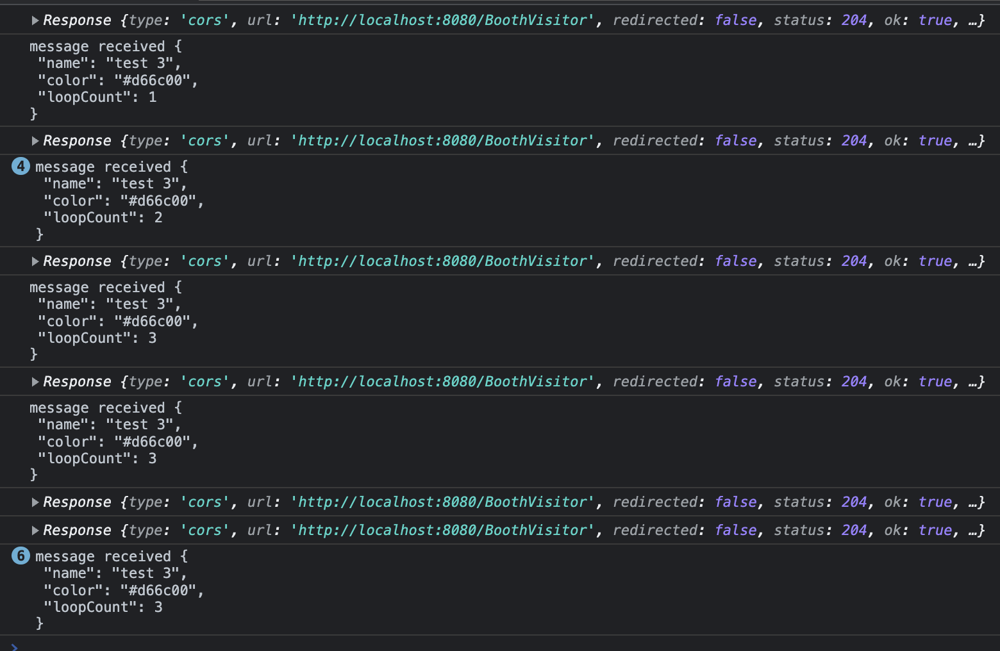

# Vortex

This demo is created to showcase multiple protocols being handled by Zilla with ease and executing a high volume of messages with low latency.

highlight green: #1ED5A7, aklivity sea green: #0D9B76, off black: #1B1E28, royal blue: #5A7CD9
12:30
off white: #EAEFEF


docker run -p 80:80 -e xeotek_kadeck_free="kadeck@wellaged.dev" -e xeotek_kadeck_port=80 xeotek/kadeck:4.2.9


## Race condition
http_messages:
```json
{
  "topic": "http_messages",
  "partition": 0,
  "offset": 38,
  "tstype": "create",
  "ts": 1684167871135,
  "broker": 1,
  "headers": [
    "content-type",
    "application/json"
  ],
  "key": null,
  "payload": "{\"name\":\"test 3\",\"color\":\"#d66c00\",\"loopCount\":0}"
}
{
  "topic": "http_messages",
  "partition": 0,
  "offset": 39,
  "tstype": "create",
  "ts": 1684167872717,
  "broker": 1,
  "headers": [
    "content-type",
    "application/json"
  ],
  "key": null,
  "payload": "{\"name\":\"test 3\",\"color\":\"#d66c00\",\"loopCount\":1}"
}
{
  "topic": "http_messages",
  "partition": 0,
  "offset": 40,
  "tstype": "create",
  "ts": 1684167872955,
  "broker": 1,
  "headers": [
    "content-type",
    "application/json"
  ],
  "key": null,
  "payload": "{\"name\":\"test 3\",\"color\":\"#d66c00\",\"loopCount\":1}"
}
{
  "topic": "http_messages",
  "partition": 0,
  "offset": 41,
  "tstype": "create",
  "ts": 1684167872955,
  "broker": 1,
  "headers": [
    "content-type",
    "application/json"
  ],
  "key": null,
  "payload": "{\"name\":\"test 3\",\"color\":\"#d66c00\",\"loopCount\":1}"
}
{
  "topic": "http_messages",
  "partition": 0,
  "offset": 42,
  "tstype": "create",
  "ts": 1684167873000,
  "broker": 1,
  "headers": [
    "content-type",
    "application/json"
  ],
  "key": null,
  "payload": "{\"name\":\"test 3\",\"color\":\"#d66c00\",\"loopCount\":1}"
}
{
  "topic": "http_messages",
  "partition": 0,
  "offset": 43,
  "tstype": "create",
  "ts": 1684167873966,
  "broker": 1,
  "headers": [
    "content-type",
    "application/json"
  ],
  "key": null,
  "payload": "{\"name\":\"test 3\",\"color\":\"#d66c00\",\"loopCount\":2}"
}
{
  "topic": "http_messages",
  "partition": 0,
  "offset": 44,
  "tstype": "create",
  "ts": 1684167874124,
  "broker": 1,
  "headers": [
    "content-type",
    "application/json"
  ],
  "key": null,
  "payload": "{\"name\":\"test 3\",\"color\":\"#d66c00\",\"loopCount\":2}"
}
{
  "topic": "http_messages",
  "partition": 0,
  "offset": 45,
  "tstype": "create",
  "ts": 1684167874192,
  "broker": 1,
  "headers": [
    "content-type",
    "application/json"
  ],
  "key": null,
  "payload": "{\"name\":\"test 3\",\"color\":\"#d66c00\",\"loopCount\":2}"
}
{
  "topic": "http_messages",
  "partition": 0,
  "offset": 46,
  "tstype": "create",
  "ts": 1684167874282,
  "broker": 1,
  "headers": [
    "content-type",
    "application/json"
  ],
  "key": null,
  "payload": "{\"name\":\"test 3\",\"color\":\"#d66c00\",\"loopCount\":2}"
}
{
  "topic": "http_messages",
  "partition": 0,
  "offset": 47,
  "tstype": "create",
  "ts": 1684167875085,
  "broker": 1,
  "headers": [
    "content-type",
    "application/json"
  ],
  "key": null,
  "payload": "{\"name\":\"test 3\",\"color\":\"#d66c00\",\"loopCount\":2}"
}
{
  "topic": "http_messages",
  "partition": 0,
  "offset": 48,
  "tstype": "create",
  "ts": 1684167875083,
  "broker": 1,
  "headers": [
    "content-type",
    "application/json"
  ],
  "key": null,
  "payload": "{\"name\":\"test 3\",\"color\":\"#d66c00\",\"loopCount\":2}"
}
{
  "topic": "http_messages",
  "partition": 0,
  "offset": 49,
  "tstype": "create",
  "ts": 1684167875123,
  "broker": 1,
  "headers": [
    "content-type",
    "application/json"
  ],
  "key": null,
  "payload": "{\"name\":\"test 3\",\"color\":\"#d66c00\",\"loopCount\":2}"
}
{
  "topic": "http_messages",
  "partition": 0,
  "offset": 50,
  "tstype": "create",
  "ts": 1684167875130,
  "broker": 1,
  "headers": [
    "content-type",
    "application/json"
  ],
  "key": null,
  "payload": "{\"name\":\"test 3\",\"color\":\"#d66c00\",\"loopCount\":2}"
}
```

kafka-event-translator:

```shell
sending to GRPC_TOPIC Record:(null, {"name":"test 3","color":"#d66c00","loopCount":0}, 0, 38)
sending to SSE_TOPIC Record:(03286581-2343-44aa-941d-0acd2c9735b3-63d4315234e3d00275a85b7a33928b6d, 
test 3#d66c00, 0, 76)
sending to GRPC_TOPIC Record:(null, {"name":"test 3","color":"#d66c00","loopCount":1}, 0, 39)
sending to SSE_TOPIC Record:(e159a08c-88bc-48cd-8f36-50a92edbd2e7-63d4315234e3d00275a85b7a33928b6d, 
test 3#d66c00, 0, 78)
sending to GRPC_TOPIC Record:(null, {"name":"test 3","color":"#d66c00","loopCount":1}, 0, 40)
sending to GRPC_TOPIC Record:(null, {"name":"test 3","color":"#d66c00","loopCount":1}, 0, 41)
sending to GRPC_TOPIC Record:(null, {"name":"test 3","color":"#d66c00","loopCount":1}, 0, 42)
sending to SSE_TOPIC Record:(ef8facf0-1e0b-4329-b52a-a4dfa1a4713a-63d4315234e3d00275a85b7a33928b6d, 
test 3#d66c00, 0, 80)
sending to SSE_TOPIC Record:(59ec41e9-13d7-4662-b6fb-ff087d2f6560-63d4315234e3d00275a85b7a33928b6d, 
test 3#d66c00, 0, 82)
sending to SSE_TOPIC Record:(18ab6e81-2298-4988-8b0c-af5bd6cbfe36-63d4315234e3d00275a85b7a33928b6d, 
test 3#d66c00, 0, 84)
sending to GRPC_TOPIC Record:(null, {"name":"test 3","color":"#d66c00","loopCount":2}, 0, 43)
sending to SSE_TOPIC Record:(da40d3ad-067c-4e44-97c7-0a4e7ecbcf77-63d4315234e3d00275a85b7a33928b6d, 
test 3#d66c00, 0, 86)
sending to GRPC_TOPIC Record:(null, {"name":"test 3","color":"#d66c00","loopCount":2}, 0, 44)
sending to SSE_TOPIC Record:(810978b1-dda5-476e-b027-4c7376c2e4a5-63d4315234e3d00275a85b7a33928b6d, 
test 3#d66c00, 0, 88)
sending to GRPC_TOPIC Record:(null, {"name":"test 3","color":"#d66c00","loopCount":2}, 0, 45)
sending to GRPC_TOPIC Record:(null, {"name":"test 3","color":"#d66c00","loopCount":2}, 0, 46)
sending to SSE_TOPIC Record:(e113bace-230d-4cd1-92b1-7ab8eadb58c8-63d4315234e3d00275a85b7a33928b6d, 
test 3#d66c00, 0, 90)
sending to SSE_TOPIC Record:(6ea96754-ad23-42de-8203-ba56749b96aa-63d4315234e3d00275a85b7a33928b6d, 
test 3#d66c00, 0, 92)
sending to GRPC_TOPIC Record:(null, {"name":"test 3","color":"#d66c00","loopCount":2}, 0, 47)
sending to GRPC_TOPIC Record:(null, {"name":"test 3","color":"#d66c00","loopCount":2}, 0, 48)
sending to GRPC_TOPIC Record:(null, {"name":"test 3","color":"#d66c00","loopCount":2}, 0, 49)
sending to GRPC_TOPIC Record:(null, {"name":"test 3","color":"#d66c00","loopCount":2}, 0, 50)
sending to SSE_TOPIC Record:(ac12bf75-32cf-4b67-8dd9-b9c00b24de50-63d4315234e3d00275a85b7a33928b6d, 
test 3#d66c00, 0, 94)
sending to SSE_TOPIC Record:(7d1fc21b-4f8d-4488-bf41-35fd36b831e4-63d4315234e3d00275a85b7a33928b6d, 
test 3#d66c00, 0, 96)
sending to SSE_TOPIC Record:(f08119eb-8843-43b4-9050-448709d24f44-63d4315234e3d00275a85b7a33928b6d, 
test 3#d66c00, 0, 98)
sending to SSE_TOPIC Record:(104c815b-0f7b-4535-89e5-8033634af882-63d4315234e3d00275a85b7a33928b6d, 
test 3#d66c00, 0, 100)
```

grpc-client:

```shell
Found message: name: "test 3"
color: "#d66c00"
32767: "\001\002\000N"

Found message: name: "test 3"
color: "#d66c00"
loop_count: 1
32767: "\001\002\000P"

Found message: name: "test 3"
color: "#d66c00"
loop_count: 1
32767: "\001\002\000R"

Found message: name: "test 3"
color: "#d66c00"
loop_count: 1
32767: "\001\002\000T"

Found message: name: "test 3"
color: "#d66c00"
loop_count: 1
32767: "\001\002\000V"

Found message: name: "test 3"
color: "#d66c00"
loop_count: 2
32767: "\001\002\000X"

Found message: name: "test 3"
color: "#d66c00"
loop_count: 2
32767: "\001\002\000Z"

Found message: name: "test 3"
color: "#d66c00"
loop_count: 2
32767: "\001\002\000\\"

Found message: name: "test 3"
color: "#d66c00"
loop_count: 2
32767: "\001\002\000^"

Found message: name: "test 3"
color: "#d66c00"
loop_count: 2
32767: "\001\002\000`"

Found message: name: "test 3"
color: "#d66c00"
loop_count: 2
32767: "\001\002\000b"

Found message: name: "test 3"
color: "#d66c00"
loop_count: 2
32767: "\001\002\000d"

Found message: name: "test 3"
color: "#d66c00"
loop_count: 2
32767: "\001\002\000f"
```

ui:


