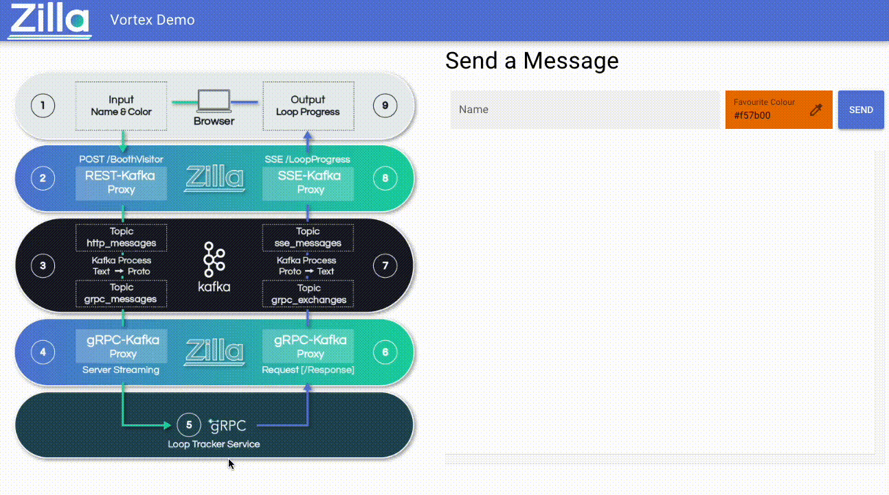

# Vortex

This demo is created to showcase multiple protocols being handled by Zilla with ease and executing a high volume of messages with low latency.



## Requirements

- Docker Compose

## Setup

1. Start all of the services using `docker-compose`. The `startup.sh` script will `build` and `start` all of the needed services. This command will also `restart` an existing stack.

    ```bash
    sh startup.sh
    ```

    > This will take a long time to build the first time it is run since it will need to download maven and npm packages.

1. Open the UI at [localhost](http://localhost/).

1. Type a name into the input box and select a color, then click `SEND`.

1. You should see your name and a color wheel being filled out for each of the 100 messages being sent. You can see the log of each message that should look like [this](#on-message)

## Outputs

### kafka

```text
INFO  ==> ** Starting Kafka setup **
WARN  ==> You set the environment variable ALLOW_PLAINTEXT_LISTENER=yes. For safety reasons, do not use this flag in a production environment.
INFO  ==> Initializing Kafka...
INFO  ==> No injected configuration files found, creating default config files
INFO  ==> Initializing KRaft...
WARN  ==> KAFKA_KRAFT_CLUSTER_ID not set - If using multiple nodes then you must use the same Cluster ID for each one
INFO  ==> Generated Kafka cluster ID 'ZA8K9ypfQyyVGv9cwATeLQ'
INFO  ==> Formatting storage directories to add metadata...
INFO  ==> ** Kafka setup finished! **
```

### kafka-init

```text
Created topic http_messages.
Created topic grpc_messages.
Created topic grpc_exchanges.
Created topic sse_messages.
```

### zilla

Zilla will print a copy of the `zilla.yaml` file that was installed then print a line `Started` once zilla is ready for connections.

> If you don't see `Started` at the end of the zilla container output there is a know problem with macOS. Restarting the demo using the statup command should fix it. Run `docker-compose restart zilla` if this happens.

Note!
> If you see
> 
> ```text
>{
>  "name": "default"
>}
> ```
>
> then Zilla hasn't pulled in the correct zilla.yaml file

### grpc_client & kafka_event_translator

#### On startup

```text
gRPC Client Started!
```

```text
Kafka Translator Started!
```

#### On Message

```text
kafka_event_translator  | sending to GRPC_TOPIC Record:(test5A7CD9, 99)
grpc_client             | Found message: name: "test"
grpc_client             | color: "#5A7CD9"
grpc_client             | loop_count: 99
grpc_client             | 32767: "\001\002\000\310\001"
grpc_client             | 
kafka_event_translator  | sending to SSE_TOPIC Record:(
kafka_event_translator  | test#5A7CD9d, 198)
```

### vortex_ui

```text
/docker-entrypoint.sh: Configuration complete; ready for start up
```

### http_messages & grpc_messages & sse_messages

Each message makes a round through the three kafka topics. These containers print the contents of these topics as they receive the messages.

```text
http_messages | {"topic":"http_messages","partition":0,"offset":99,"tstype":"create","ts":1685641119345,"headers":["content-type","application/json"],"key":"test5A7CD9","payload":"{\"name\":\"test\",\"color\":\"#5A7CD9\",\"loopCount\":99}"}
grpc_messages | {"topic":"grpc_messages","partition":0,"offset":99,"tstype":"create","ts":1685641119358,"key":"test5A7CD9","payload":"\n\u0004test\u0012\u0007#5A7CD9\u0018c"}
sse_messages  | {"topic":"sse_messages","partition":0,"offset":99,"tstype":"create","ts":1685641119389,"key":"7f2b31b5-45a6-4ab3-8597-375dea9b5869-63d4315234e3d00275a85b7a33928b6d","payload":"{\n  \"name\": \"test\",\n  \"color\": \"#5A7CD9\",\n  \"loopCount\": 100\n}"}
```
