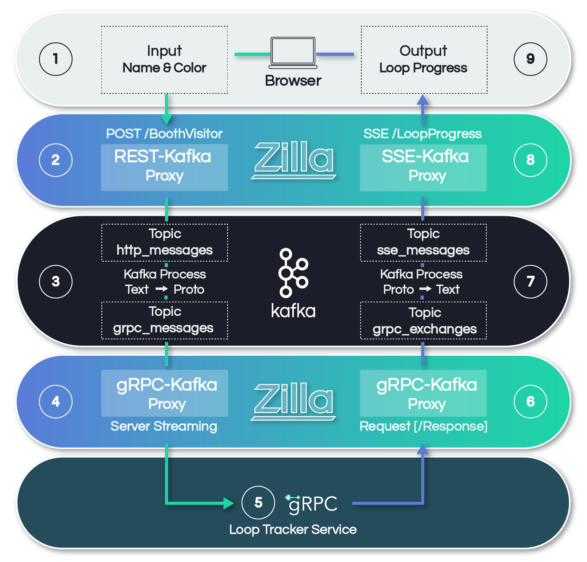

# Vortex

This demo is created to showcase multiple protocols being handled by Zilla with ease and executing a high volume of messages with low latency.



## Requirements

- Docker Compose

## Setup

Start all of the services using `docker-compose`. The `reload.sh` script will build and start all of the needed services

```bash
sh reload.sh
```

## Outputs

### kafka

```
Welcome to the Bitnami kafka container
Subscribe to project updates by watching https://github.com/bitnami/containers
Submit issues and feature requests at https://github.com/bitnami/containers/issues

INFO  ==> ** Starting Kafka setup **
WARN  ==> You set the environment variable ALLOW_PLAINTEXT_LISTENER=yes. For safety reasons, do not use this flag in a production environment.
INFO  ==> Initializing Kafka...
INFO  ==> No injected configuration files found, creating default config files
INFO  ==> Initializing KRaft...
WARN  ==> KAFKA_KRAFT_CLUSTER_ID not set - If using multiple nodes then you must use the same Cluster ID for each one
INFO  ==> Generated Kafka cluster ID 'ZA8K9ypfQyyVGv9cwATeLQ'
INFO  ==> Formatting storage directories to add metadata...
INFO  ==> ** Kafka setup finished! **
```

### kafka-init

```
Created topic http_messages.
Created topic grpc_messages.
Created topic grpc_exchanges.
Created topic sse_messages.
```

### zilla
